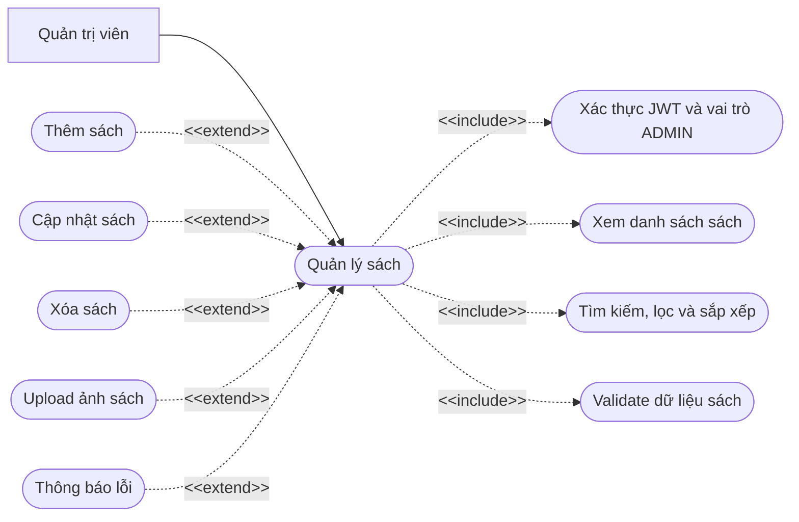
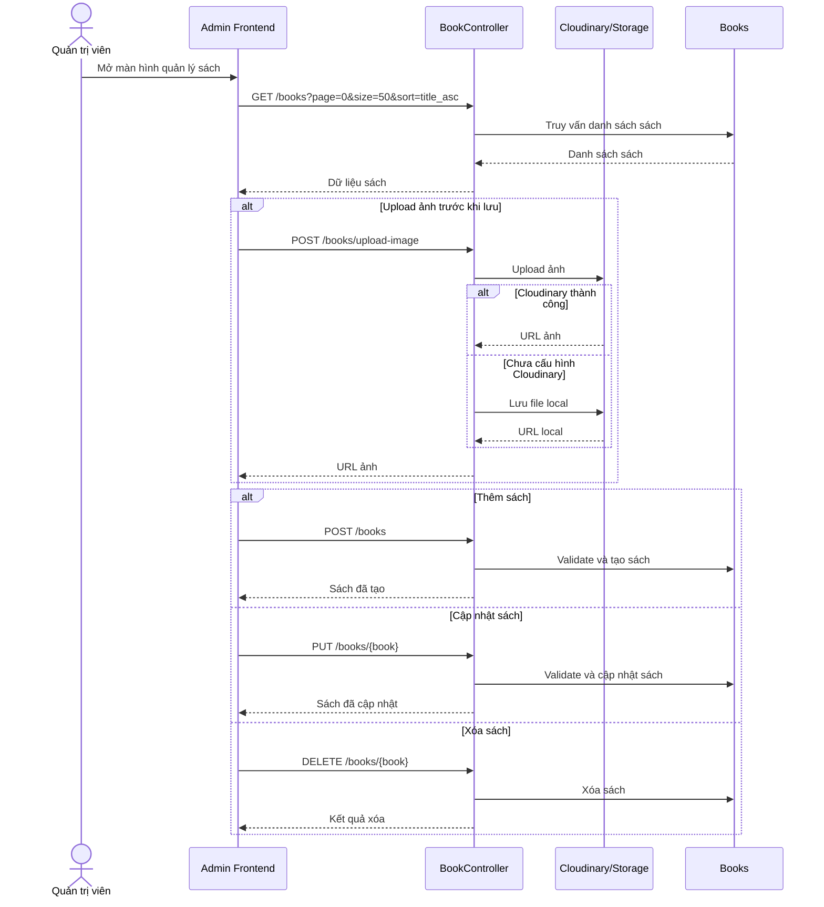

# Chức năng quản lý sách

## API chính

- `GET /books`
- `GET /books/{book}`
- `POST /books`
- `PUT /books/{book}`
- `DELETE /books/{book}`
- `POST /books/upload-image`

## Use case

## Sequence diagram

