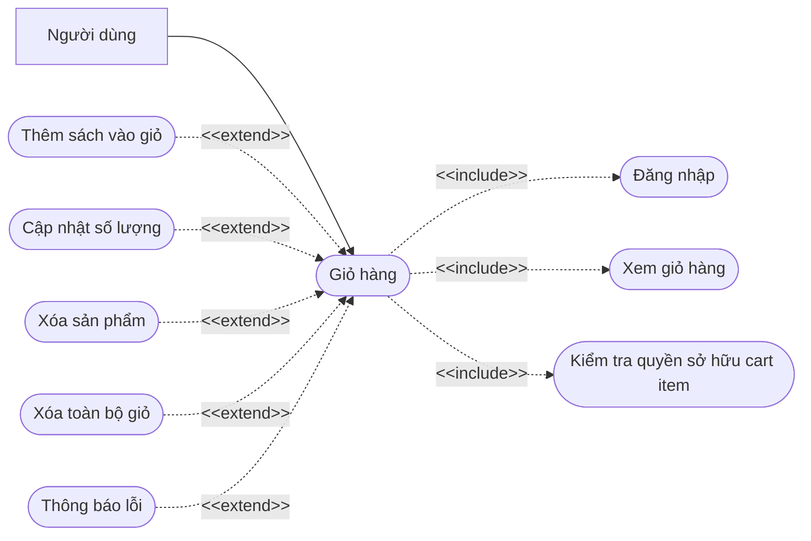
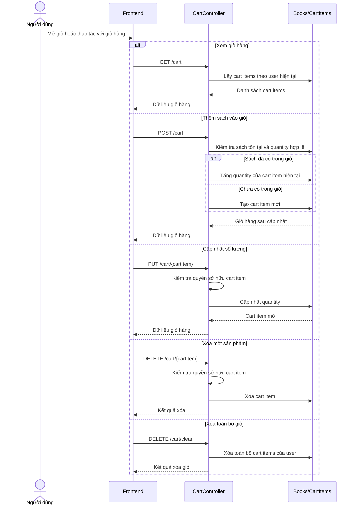

# Chức năng giỏ hàng

## API chính

- `GET /cart`
- `POST /cart`
- `PUT /cart/{cartItem}`
- `DELETE /cart/{cartItem}`
- `DELETE /cart/clear`

## Use case

```mermaid
flowchart LR
    user["Người dùng"]

    main([Giỏ hàng])
    auth([Đăng nhập])
    view([Xem giỏ hàng])
    own([Kiểm tra quyền sở hữu cart item])
    add([Thêm sách vào giỏ])
    update([Cập nhật số lượng])
    remove([Xóa sản phẩm])
    clear([Xóa toàn bộ giỏ])
    error([Thông báo lỗi])

    user --> main
    main -.->|"&lt;&lt;include&gt;&gt;"| auth
    main -.->|"&lt;&lt;include&gt;&gt;"| view
    main -.->|"&lt;&lt;include&gt;&gt;"| own
    add -.->|"&lt;&lt;extend&gt;&gt;"| main
    update -.->|"&lt;&lt;extend&gt;&gt;"| main
    remove -.->|"&lt;&lt;extend&gt;&gt;"| main
    clear -.->|"&lt;&lt;extend&gt;&gt;"| main
    error -.->|"&lt;&lt;extend&gt;&gt;"| main
```

## Sequence diagram

```mermaid
%%{init: {"themeVariables": {"fontSize": "14px"}} }%%
sequenceDiagram
    actor User as Người dùng
    participant UI as Frontend
    participant API as CartController
    participant DB as Books/CartItems

    User->>UI: Mở giỏ hoặc thao tác với giỏ hàng
    alt Xem giỏ hàng
        UI->>API: GET /cart
        API->>DB: Lấy cart items theo user hiện tại
        DB-->>API: Danh sách cart items
        API-->>UI: Dữ liệu giỏ hàng
    else Thêm sách vào giỏ
        UI->>API: POST /cart
        API->>DB: Kiểm tra sách tồn tại và quantity hợp lệ
        alt Sách đã có trong giỏ
            API->>DB: Tăng quantity của cart item hiện tại
        else Chưa có trong giỏ
            API->>DB: Tạo cart item mới
        end
        DB-->>API: Giỏ hàng sau cập nhật
        API-->>UI: Dữ liệu giỏ hàng
    else Cập nhật số lượng
        UI->>API: PUT /cart/{cartItem}
        API->>API: Kiểm tra quyền sở hữu cart item
        API->>DB: Cập nhật quantity
        DB-->>API: Cart item mới
        API-->>UI: Dữ liệu giỏ hàng
    else Xóa một sản phẩm
        UI->>API: DELETE /cart/{cartItem}
        API->>API: Kiểm tra quyền sở hữu cart item
        API->>DB: Xóa cart item
        API-->>UI: Kết quả xóa
    else Xóa toàn bộ giỏ
        UI->>API: DELETE /cart/clear
        API->>DB: Xóa toàn bộ cart items của user
        API-->>UI: Kết quả xóa giỏ
    end
```
