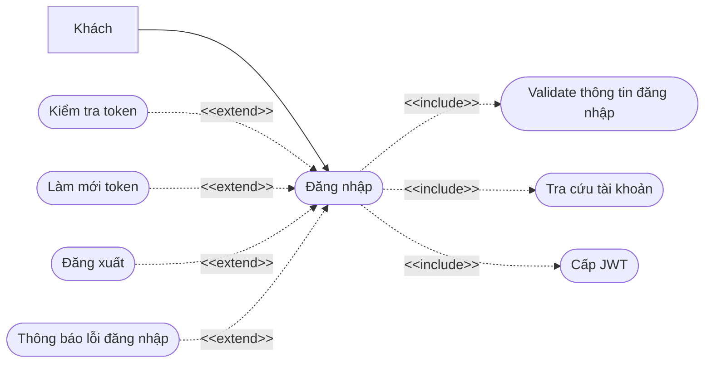
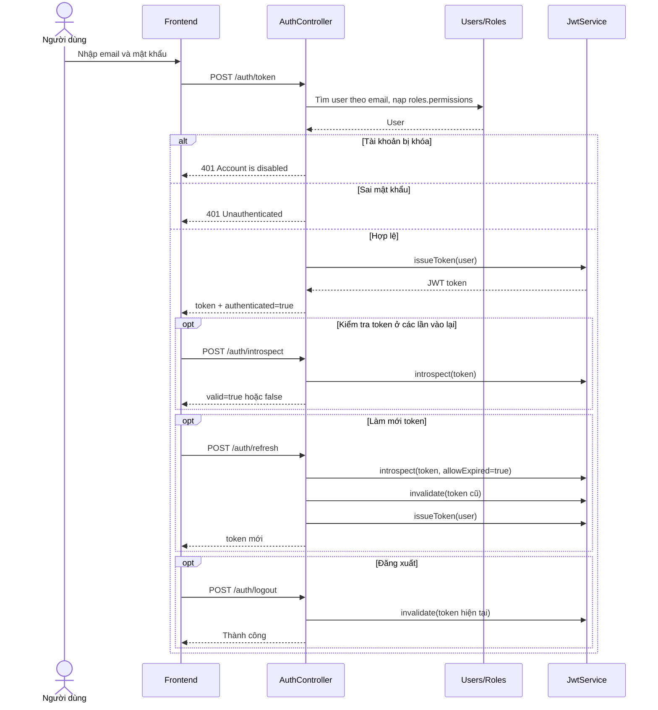

# Chức năng đăng nhập

## API chính

- `POST /auth/token`
- `POST /auth/introspect`
- `POST /auth/refresh`
- `POST /auth/logout`

## Use case

```mermaid
flowchart LR
    guest["Khách"]

    main([Đăng nhập])
    validate([Validate thông tin đăng nhập])
    lookup([Tra cứu tài khoản])
    issue([Cấp JWT])
    introspect([Kiểm tra token])
    refresh([Làm mới token])
    logout([Đăng xuất])
    error([Thông báo lỗi đăng nhập])

    guest --> main
    main -.->|"&lt;&lt;include&gt;&gt;"| validate
    main -.->|"&lt;&lt;include&gt;&gt;"| lookup
    main -.->|"&lt;&lt;include&gt;&gt;"| issue
    introspect -.->|"&lt;&lt;extend&gt;&gt;"| main
    refresh -.->|"&lt;&lt;extend&gt;&gt;"| main
    logout -.->|"&lt;&lt;extend&gt;&gt;"| main
    error -.->|"&lt;&lt;extend&gt;&gt;"| main
```

## Sequence diagram

```mermaid
%%{init: {"themeVariables": {"fontSize": "14px"}} }%%
sequenceDiagram
    actor User as Người dùng
    participant UI as Frontend
    participant API as AuthController
    participant DB as Users/Roles
    participant JWT as JwtService

    User->>UI: Nhập email và mật khẩu
    UI->>API: POST /auth/token
    API->>DB: Tìm user theo email, nạp roles.permissions
    DB-->>API: User
    alt Tài khoản bị khóa
        API-->>UI: 401 Account is disabled
    else Sai mật khẩu
        API-->>UI: 401 Unauthenticated
    else Hợp lệ
        API->>JWT: issueToken(user)
        JWT-->>API: JWT token
        API-->>UI: token + authenticated=true
        opt Kiểm tra token ở các lần vào lại
            UI->>API: POST /auth/introspect
            API->>JWT: introspect(token)
            API-->>UI: valid=true hoặc false
        end
        opt Làm mới token
            UI->>API: POST /auth/refresh
            API->>JWT: introspect(token, allowExpired=true)
            API->>JWT: invalidate(token cũ)
            API->>JWT: issueToken(user)
            API-->>UI: token mới
        end
        opt Đăng xuất
            UI->>API: POST /auth/logout
            API->>JWT: invalidate(token hiện tại)
            API-->>UI: Thành công
        end
    end
```
