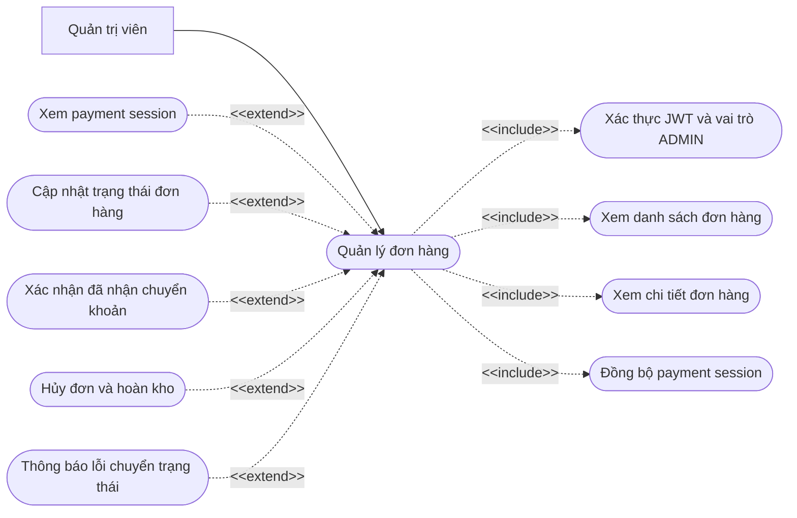
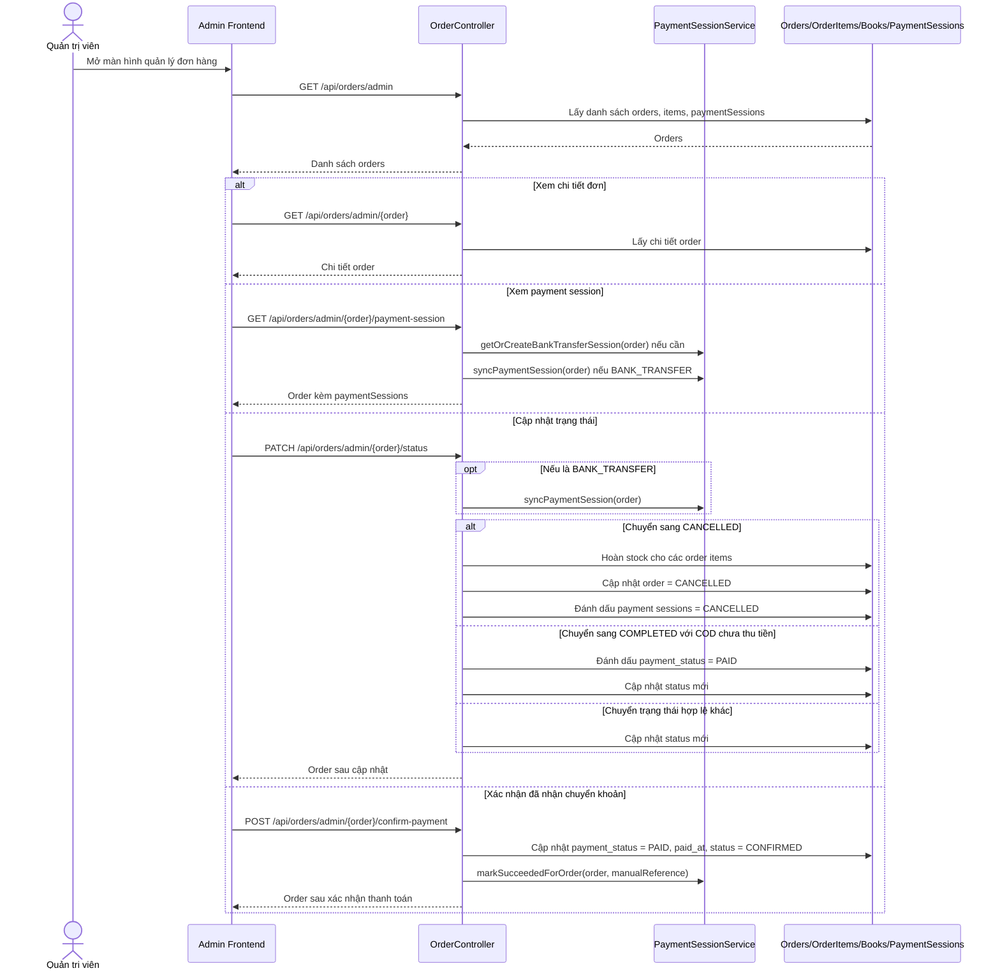

# Chức năng quản lý đơn hàng

## API chính

- `GET /api/orders/admin`
- `GET /api/orders/admin/{order}`
- `GET /api/orders/admin/{order}/payment-session`
- `PATCH /api/orders/admin/{order}/status`
- `POST /api/orders/admin/{order}/confirm-payment`

## Use case

## Sequence diagram

