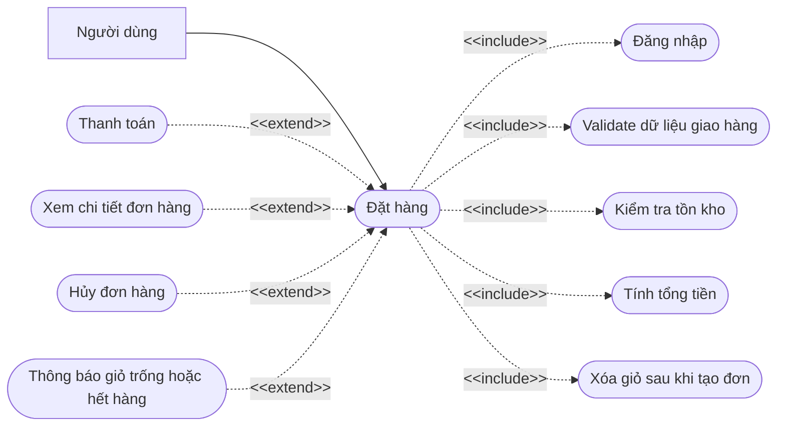
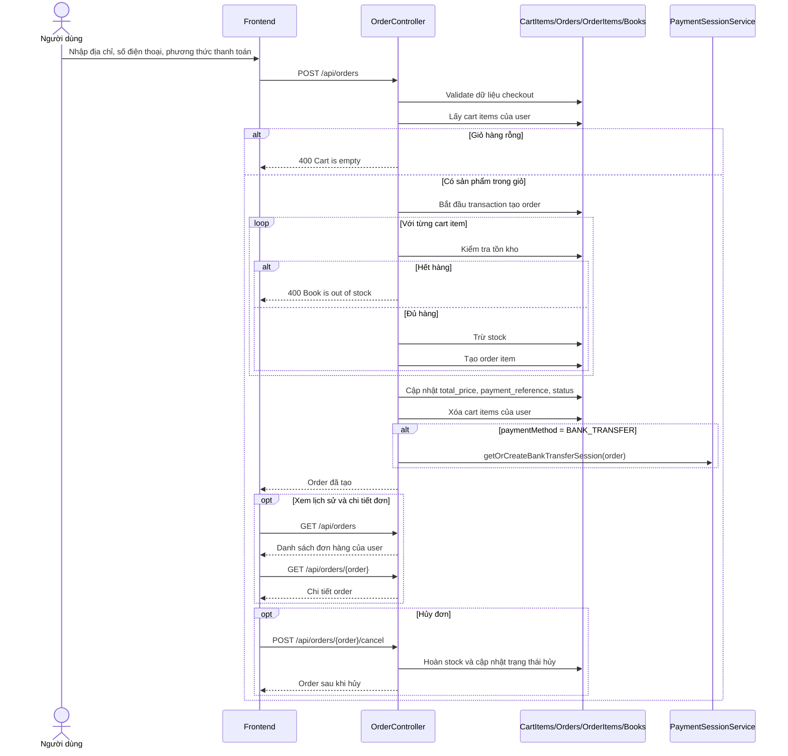

# Chức năng đặt hàng

## API chính

- `POST /api/orders`
- `GET /api/orders`
- `GET /api/orders/{order}`
- `POST /api/orders/{order}/cancel`

## Use case

```mermaid
flowchart LR
    user["Người dùng"]

    main([Đặt hàng])
    auth([Đăng nhập])
    validate([Validate dữ liệu giao hàng])
    stock([Kiểm tra tồn kho])
    total([Tính tổng tiền])
    clear([Xóa giỏ sau khi tạo đơn])
    payment([Thanh toán])
    detail([Xem chi tiết đơn hàng])
    cancel([Hủy đơn hàng])
    error([Thông báo giỏ trống hoặc hết hàng])

    user --> main
    main -.->|"&lt;&lt;include&gt;&gt;"| auth
    main -.->|"&lt;&lt;include&gt;&gt;"| validate
    main -.->|"&lt;&lt;include&gt;&gt;"| stock
    main -.->|"&lt;&lt;include&gt;&gt;"| total
    main -.->|"&lt;&lt;include&gt;&gt;"| clear
    payment -.->|"&lt;&lt;extend&gt;&gt;"| main
    detail -.->|"&lt;&lt;extend&gt;&gt;"| main
    cancel -.->|"&lt;&lt;extend&gt;&gt;"| main
    error -.->|"&lt;&lt;extend&gt;&gt;"| main
```

## Sequence diagram

```mermaid
%%{init: {"themeVariables": {"fontSize": "14px"}} }%%
sequenceDiagram
    actor User as Người dùng
    participant UI as Frontend
    participant API as OrderController
    participant DB as CartItems/Orders/OrderItems/Books
    participant PSS as PaymentSessionService

    User->>UI: Nhập địa chỉ, số điện thoại, phương thức thanh toán
    UI->>API: POST /api/orders
    API->>DB: Validate dữ liệu checkout
    API->>DB: Lấy cart items của user
    alt Giỏ hàng rỗng
        API-->>UI: 400 Cart is empty
    else Có sản phẩm trong giỏ
        API->>DB: Bắt đầu transaction tạo order
        loop Với từng cart item
            API->>DB: Kiểm tra tồn kho
            alt Hết hàng
                API-->>UI: 400 Book is out of stock
            else Đủ hàng
                API->>DB: Trừ stock
                API->>DB: Tạo order item
            end
        end
        API->>DB: Cập nhật total_price, payment_reference, status
        API->>DB: Xóa cart items của user
        alt paymentMethod = BANK_TRANSFER
            API->>PSS: getOrCreateBankTransferSession(order)
        end
        API-->>UI: Order đã tạo
        opt Xem lịch sử và chi tiết đơn
            UI->>API: GET /api/orders
            API-->>UI: Danh sách đơn hàng của user
            UI->>API: GET /api/orders/{order}
            API-->>UI: Chi tiết order
        end
        opt Hủy đơn
            UI->>API: POST /api/orders/{order}/cancel
            API->>DB: Hoàn stock và cập nhật trạng thái hủy
            API-->>UI: Order sau khi hủy
        end
    end
```
