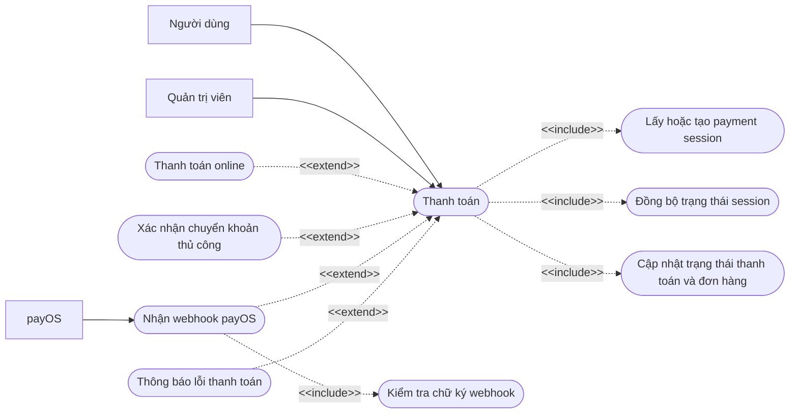
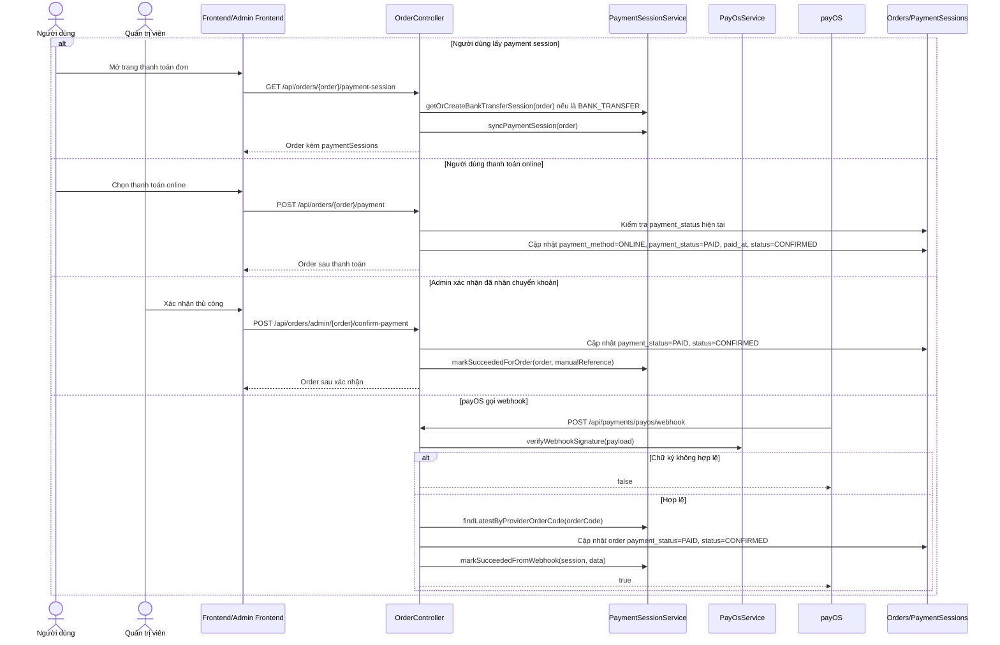

# Chức năng thanh toán

## API chính

- `GET /api/orders/{order}/payment-session`
- `POST /api/orders/{order}/payment`
- `GET /api/orders/admin/{order}/payment-session`
- `POST /api/orders/admin/{order}/confirm-payment`
- `POST /api/payments/payos/webhook`

## Use case

## Sequence diagram

