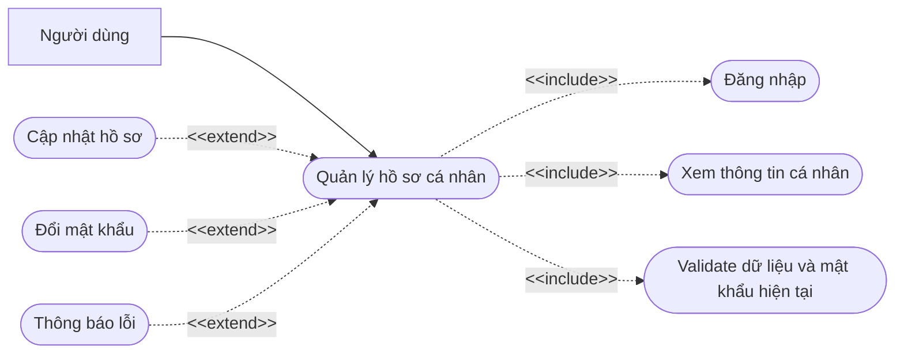
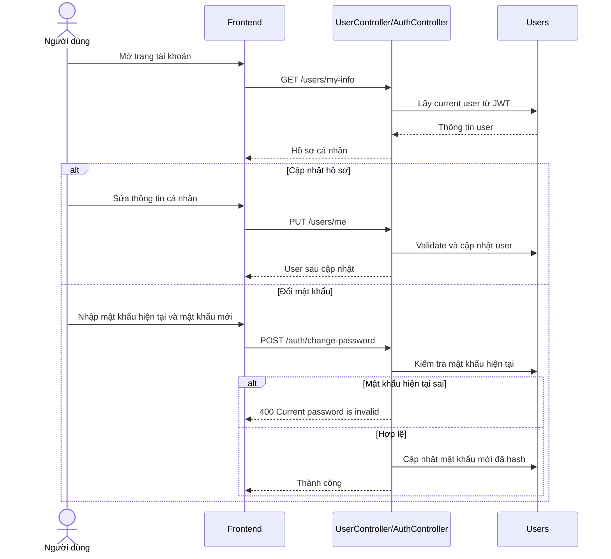

# Chức năng quản lý hồ sơ cá nhân

## API chính

- `GET /users/my-info`
- `PUT /users/me`
- `POST /auth/change-password`

## Use case

```mermaid
flowchart LR
    user["Người dùng"]

    main([Quản lý hồ sơ cá nhân])
    auth([Đăng nhập])
    view([Xem thông tin cá nhân])
    validate([Validate dữ liệu và mật khẩu hiện tại])
    update([Cập nhật hồ sơ])
    password([Đổi mật khẩu])
    error([Thông báo lỗi])

    user --> main
    main -.->|"&lt;&lt;include&gt;&gt;"| auth
    main -.->|"&lt;&lt;include&gt;&gt;"| view
    main -.->|"&lt;&lt;include&gt;&gt;"| validate
    update -.->|"&lt;&lt;extend&gt;&gt;"| main
    password -.->|"&lt;&lt;extend&gt;&gt;"| main
    error -.->|"&lt;&lt;extend&gt;&gt;"| main
```

## Sequence diagram

```mermaid
%%{init: {"themeVariables": {"fontSize": "14px"}} }%%
sequenceDiagram
    actor User as Người dùng
    participant UI as Frontend
    participant API as UserController/AuthController
    participant DB as Users

    User->>UI: Mở trang tài khoản
    UI->>API: GET /users/my-info
    API->>DB: Lấy current user từ JWT
    DB-->>API: Thông tin user
    API-->>UI: Hồ sơ cá nhân
    alt Cập nhật hồ sơ
        User->>UI: Sửa thông tin cá nhân
        UI->>API: PUT /users/me
        API->>DB: Validate và cập nhật user
        API-->>UI: User sau cập nhật
    else Đổi mật khẩu
        User->>UI: Nhập mật khẩu hiện tại và mật khẩu mới
        UI->>API: POST /auth/change-password
        API->>DB: Kiểm tra mật khẩu hiện tại
        alt Mật khẩu hiện tại sai
            API-->>UI: 400 Current password is invalid
        else Hợp lệ
            API->>DB: Cập nhật mật khẩu mới đã hash
            API-->>UI: Thành công
        end
    end
```
