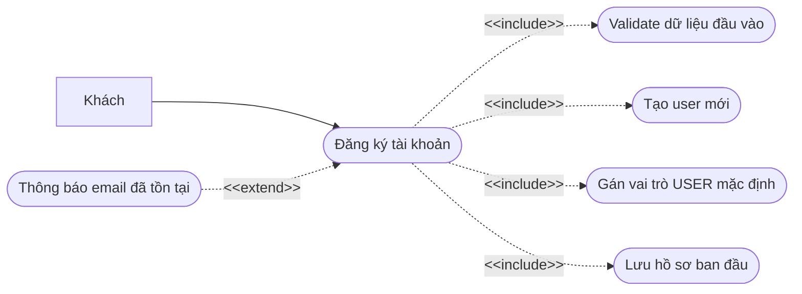
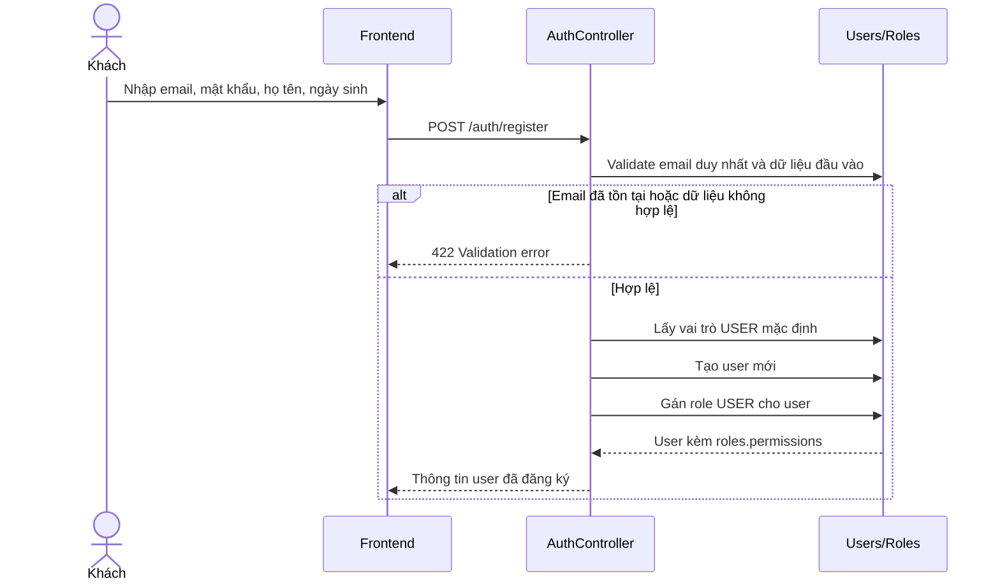

# Chức năng đăng ký

## API chính

- `POST /auth/register`

## Use case

```mermaid
flowchart LR
    guest["Khách"]

    main([Đăng ký tài khoản])
    validate([Validate dữ liệu đầu vào])
    create([Tạo user mới])
    assign([Gán vai trò USER mặc định])
    profile([Lưu hồ sơ ban đầu])
    duplicate([Thông báo email đã tồn tại])

    guest --> main
    main -.->|"&lt;&lt;include&gt;&gt;"| validate
    main -.->|"&lt;&lt;include&gt;&gt;"| create
    main -.->|"&lt;&lt;include&gt;&gt;"| assign
    main -.->|"&lt;&lt;include&gt;&gt;"| profile
    duplicate -.->|"&lt;&lt;extend&gt;&gt;"| main
```

## Sequence diagram

```mermaid
%%{init: {"themeVariables": {"fontSize": "14px"}} }%%
sequenceDiagram
    actor Guest as Khách
    participant UI as Frontend
    participant API as AuthController
    participant DB as Users/Roles

    Guest->>UI: Nhập email, mật khẩu, họ tên, ngày sinh
    UI->>API: POST /auth/register
    API->>DB: Validate email duy nhất và dữ liệu đầu vào
    alt Email đã tồn tại hoặc dữ liệu không hợp lệ
        API-->>UI: 422 Validation error
    else Hợp lệ
        API->>DB: Lấy vai trò USER mặc định
        API->>DB: Tạo user mới
        API->>DB: Gán role USER cho user
        DB-->>API: User kèm roles.permissions
        API-->>UI: Thông tin user đã đăng ký
    end
```
