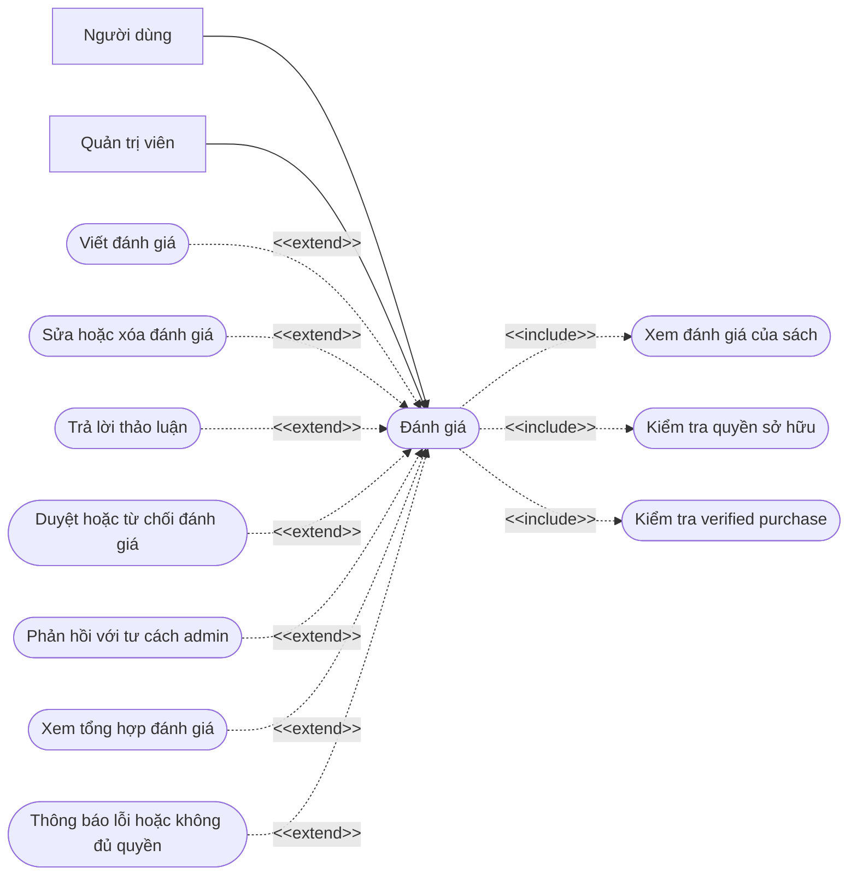
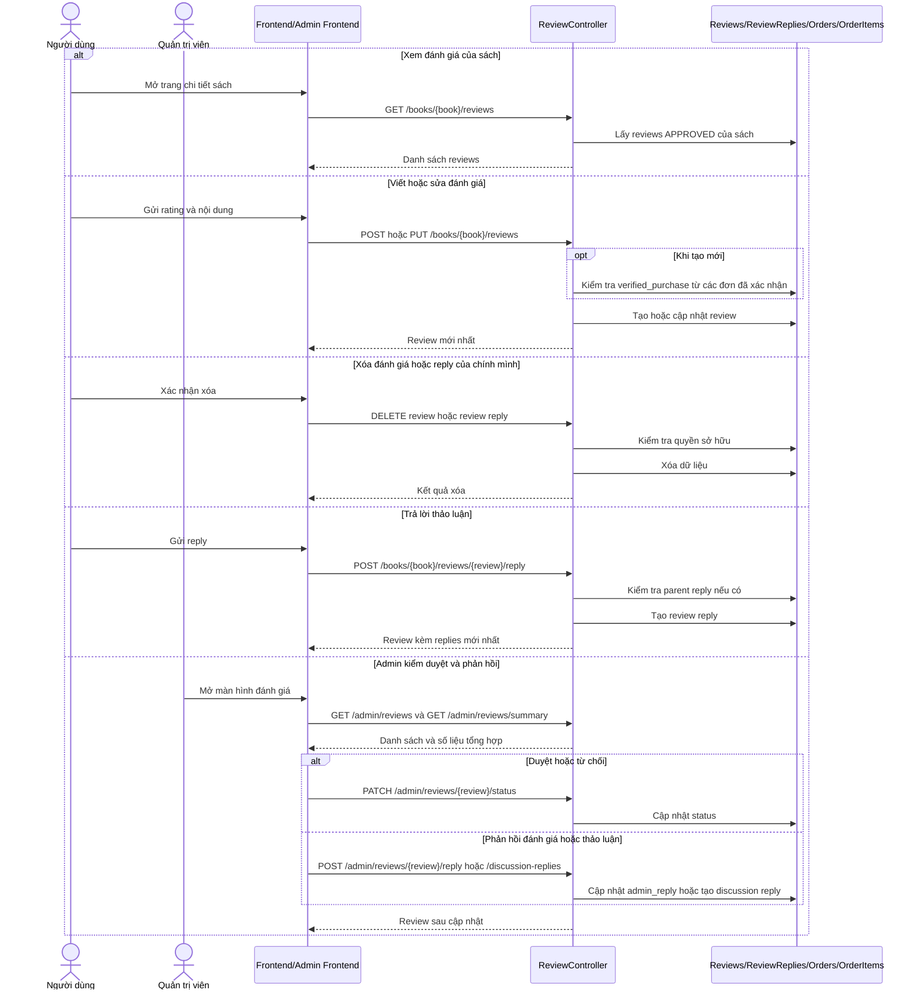

# Chức năng đánh giá

## API chính

- `GET /books/{book}/reviews`
- `POST /books/{book}/reviews`
- `PUT /books/{book}/reviews/{review}`
- `DELETE /books/{book}/reviews/{review}`
- `POST /books/{book}/reviews/{review}/reply`
- `PUT /books/{book}/reviews/{review}/replies/{reply}`
- `DELETE /books/{book}/reviews/{review}/replies/{reply}`
- `GET /admin/reviews`
- `GET /admin/reviews/summary`
- `PATCH /admin/reviews/{review}/status`
- `POST /admin/reviews/{review}/reply`
- `POST /admin/reviews/{review}/discussion-replies`
- `DELETE /admin/reviews/{review}/discussion-replies/{reply}`

## Use case

## Sequence diagram

