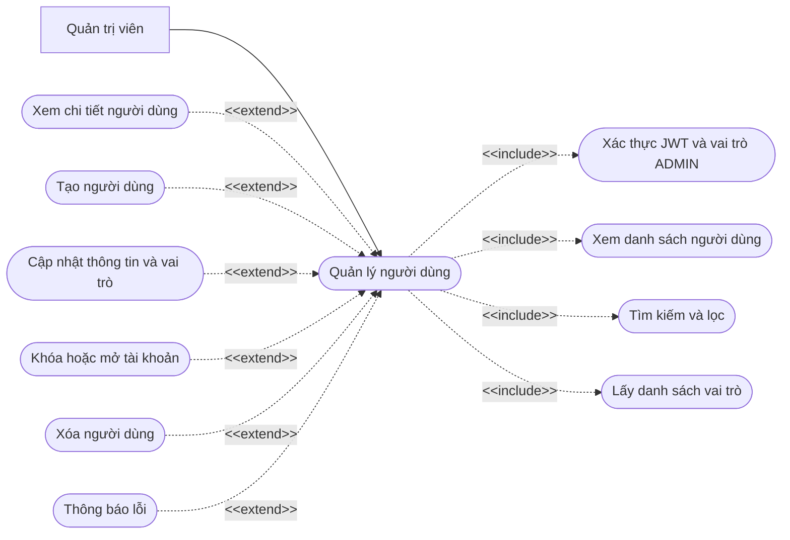
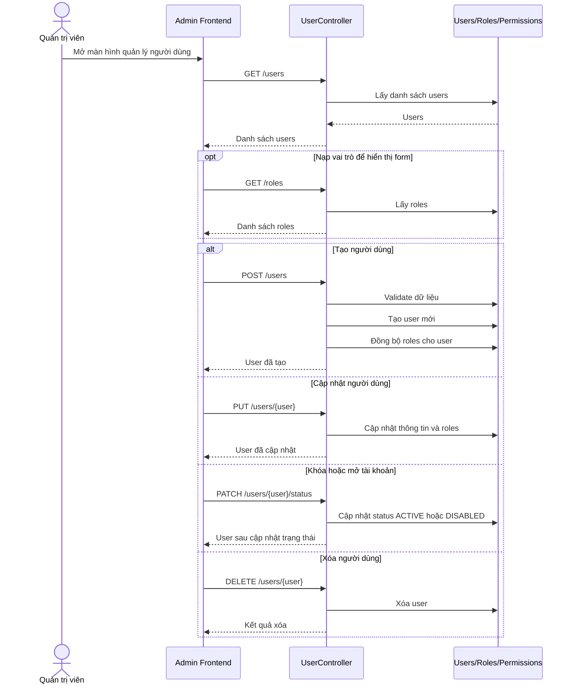

# Chức năng quản lý người dùng

## API chính

- `GET /users`
- `POST /users`
- `GET /users/{user}`
- `PUT /users/{user}`
- `PATCH /users/{user}/status`
- `DELETE /users/{user}`
- `GET /roles`
- `POST /roles`
- `GET /permissions`

## Use case

## Sequence diagram

